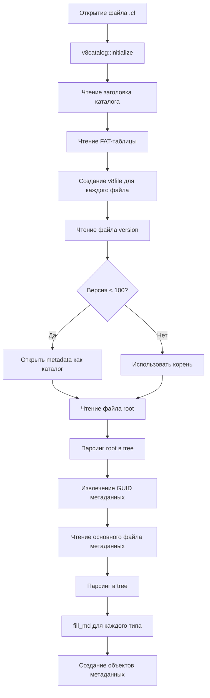

# Алгоритм чтения файла конфигурации 1С (.cf)

## Обзор архитектуры

Файл конфигурации 1С (.cf) представляет собой специализированный формат хранения, основанный на каталожной структуре с внутренней FAT-подобной системой размещения файлов.

## Уровни абстракции

```
┌─────────────────────────────────────────────────────────┐
│  Уровень 1: v8catalog (корневой каталог конфигурации)   │
├─────────────────────────────────────────────────────────┤
│  Уровень 2: v8file (отдельные файлы внутри .cf)         │
├─────────────────────────────────────────────────────────┤
│  Уровень 3: tree (парсинг текстового представления 1С)  │
├─────────────────────────────────────────────────────────┤
│  Уровень 4: TMDO/MetadataObject (объекты метаданных)    │
└─────────────────────────────────────────────────────────┘
```

---

## Этап 1: Открытие файла конфигурации

### Точка входа (MainUnit.cpp:1475-1481)

```cpp
GlobalCF = std::make_unique<v8catalog>(filename, true);
get_cf_name(GlobalCF.get(), mess);
```

### Класс v8catalog

**Расположение:** `src/APIcfBase.h`, `src/APIcfBase.cpp`

**Конструкторы:**
- `v8catalog(String name, bool _zipped)` - создание из файла .cf/.epf/.erf
- `v8catalog(TStream* stream, bool _zipped, bool leave_stream)` - создание из потока
- `v8catalog(v8file* f)` - создание из вложенного файла

**Структура заголовка каталога:**

```cpp
struct catalog_header
{
    int start_empty;   // начало первого пустого блока
    int page_size;     // размер страницы (по умолчанию)
    int version;       // версия формата
    int zero;          // всегда ноль
};

struct catalog_header8316  // Для платформы 8.3.16+
{
    __int64 start_empty;
    int page_size;
    int version;
    int zero;
};
```

---

## Этап 2: Инициализация каталога (initialize)

### Проверка IsCatalog()

Метод определяет, является ли файл действительным каталогом 1С:

1. **Для старых версий (16 байт):**
   - Сверяется с шаблоном `_empty_catalog_template`
   
2. **Для новых версий:**
   - Читается `_startempty` (первые 4 байта)
   - Проверяется сигнатура `V8_FF_SIGNATURE` (0x7FFFFFFF)
   - Валидируется структура блоков по смещениям

### Чтение FAT-таблицы

**Алгоритм (APIcfBase.cpp:1219-1350):**

```
1. Прочитать заголовок каталога (16 или 20 байт)
   ├─ start_empty - начало списка свободных блоков
   ├─ page_size - размер страницы
   └─ version - версия формата

2. Прочитать FAT-таблицу (таблица размещения файлов)
   ├─ Для старых версий: read_block() со смещениями 32 бит
   └─ Для 8.3.16+: read_block_16() со смещениями 64 бит

3. Для каждой записи FAT (12 байт для старых, 24 байта для новых):
   ├─ header_start - смещение заголовка файла
   ├─ data_start - смещение данных файла
   └─ ff - сигнатура конца (0x7FFFFFFF)

4. Для каждого файла:
   ├─ Прочитать блок заголовка через read_block()
   ├─ Извлечь имя файла (UTF-16LE, смещение +20 байт)
   ├─ Извлечь время создания/модификации (__int64)
   └─ Создать объект v8file
```

**Структура FAT-записи:**

```cpp
// Старый формат (32 бит)
struct fat_item {
    int header_start;    // 4 байта
    int data_start;      // 4 байта
    int ff;              // 4 байта (0x7FFFFFFF)
};

// Новый формат 8.3.16+ (64 бит)
struct fat_item8316 {
    __int64 header_start;  // 8 байт
    __int64 data_start;    // 8 байт
    __int64 ff;            // 8 байт (0xFFFFFFFFFFFFFFFF)
};
```

---

## Этап 3: Структура файла внутри каталога (v8file)

### Класс v8file

**Расположение:** `src/APIcfBase.h`

**Ключевые поля:**
- `name` - имя файла
- `start_data` - смещение данных в каталоге
- `start_header` - смещение заголовка
- `time_create`, `time_modify` - временные метки V8
- `data` - поток данных (TStream*)
- `parent` - указатель на родительский каталог

### Заголовок файла v8file

```
Смещение  Размер  Описание
─────────────────────────────────────
0         8       Время создания (__int64)
8         8       Время модификации (__int64)
16        4       Ноль (зарезервировано)
20        var     Имя файла (UTF-16LE)
```

---

## Этап 4: Чтение иерархии метаданных

### Функция get_cf_name() (MainUnit.cpp:1676)

**Алгоритм:**

```
1. Прочитать файл "version"
   └─ Определить версию формата конфигурации

2. Если версия < 100 (платформа 8.0):
   └─ Открыть вложенный каталог "metadata"

3. Прочитать файл "root"
   └─ Распарсить дерево структуры

4. Извлечь GUID основного файла метаданных
   └─ Узел: tree[0][1] (тип nd_guid)

5. Открыть файл метаданных по GUID
   └─ Передать в get_cf_name(tree*, mess)
```

### Парсинг дерева (get_treeFromV8file)

**Расположение:** `src/Class_1CD.cpp:196`

```cpp
tree* __fastcall get_treeFromV8file(v8file* f)
{
    // 1. Читать байты файла
    sourceBytes = f->Read(...)
    
    // 2. Определить кодировку
    enc = TEncoding::GetBufferEncoding(sourceBytes, enc)
    
    // 3. Конвертировать в Unicode (UTF-16LE)
    unicodeBytes = TEncoding::Convert(enc, UTF-16, ...)
    
    // 4. Парсить текст 1С в дерево
    return parse_1Ctext(wstring, filename)
}
```

### Формат текстового представления 1С

**Пример:**
```
{
    "ИмяОбъекта",
    {
        "Реквизит1",
        Guid("12345678-1234-1234-1234-123456789012"),
        ...
    }
}
```

**Парсер (Parse_tree.cpp:635):**
- Состояния: `s_value`, `s_string`, `s_delimitier`, `s_nonstring`
- Типы узлов: `nd_list`, `nd_string`, `nd_number`, `nd_guid`, `nd_empty`
- Поддержка вложенных списков произвольной глубины

---

## Этап 5: Обработка объектов метаданных

### Функция fill_md() (MainUnit.cpp:1937)

**Алгоритм обработки каждого типа метаданных:**

```
1. Найти узел по GUID метаданных
   └─ find_metadata_node_by_guid(tr, guid_md)

2. Получить количество элементов
   └─ CountMD = node_md->get_next()->get_value().ToInt()

3. Для каждого элемента:
   ├─ Прочитать GUID файла объекта
   ├─ Получить v8file по имени (GUID)
   ├─ Распарсить файл в дерево (get_treeFromV8file)
   └─ Создать объект метаданных (TCatalogs, TDocuments, etc.)
```

### Карта путей к именам объектов

Для каждого типа метаданных определён путь в дереве для извлечения имени:

```cpp
std::unordered_map<String, std::vector<int>> namePaths = {
    {GUID_Catalogs,          {0,1,9,1,2}},
    {GUID_Documents,         {0,1,9,1,2}},
    {GUID_Constants,         {0,1,1,1,1,2}},
    {GUID_Reports,           {0,1,3,1,2}},
    {GUID_CommonModules,     {0,1,1,2}},
    // ... ещё 40+ типов
};
```

### Пример пути {0,1,9,1,2}:

```
tree
 └─ [0] первый элемент корневого списка
     └─ [1] второй элемент
         └─ [9] десятый элемент
             └─ [1] второй элемент
                 └─ [2] третий элемент ← ИМЯ ОБЪЕКТА
```

---

## Этап 6: Базовые классы метаданных

### BaseMetadataObject

**Расположение:** `src/BaseMetadataObject.h`

```cpp
class BaseMetadataObject
{
protected:
    v8catalog* parent;      // Родительский каталог
    String guid;            // GUID объекта
    String name;            // Имя объекта
    String synonym;         // Синоним
    
    std::unique_ptr<tree> root_data;  // Распарсенное дерево
    
public:
    __fastcall BaseMetadataObject(v8catalog* _parent, const String& _guid);
    __fastcall BaseMetadataObject(v8catalog* _parent, const String& _guid, const String& _name);
};
```

### Конструктор BaseMetadataObject

```cpp
__fastcall BaseMetadataObject::BaseMetadataObject(v8catalog* _parent, const String& _guid)
{
    parent = _parent;
    guid = _guid;
    
    // Загрузить файл объекта по GUID
    // Распарсить в дерево
    root_data.reset(get_treeFromV8file(parent->GetFile(_guid)));
    
    // Извлечь имя и синоним из дерева
    name = extract_name(root_data.get());
    synonym = extract_synonym(root_data.get());
}
```

---

## Детали форматов

### Сигнатуры блоков

```cpp
#define V8_FF_SIGNATURE      0x7FFFFFFF  // Конец цепочки блоков
#define V8_FF64_SIGNATURE    0xFFFFFFFFFFFFFFFF

// Шаблоны пустых каталогов
const char _empty_catalog_template[16] = {
    0xFF,0xFF,0xFF,0x7F,  // start_empty = -1
    0x02,0x00,            // page_size = 2?
    0x00,0x00,0x00,0x00,0x00,0x00  // version, zero
};
```

### Формат блока данных

Каждый блок в каталоге имеет заголовок:

```
Смещение  Размер  Описание
──────────────────────────────────────────
0         2       "\r\n"
2         8       Длина блока (hex ASCII)
10        1       " "
11        8       Текущая длина данных (hex ASCII)
19        1       " "
20        8       Смещение следующего блока (hex ASCII)
28        1       " "
29        2       "\r\n"
31        var     Данные блока
```

**Пример:** `\r\n00000100 000000ff 0000002a \r\n<data>`

### Преобразование времени V8

```cpp
void __fastcall V8timeToFileTime(const __int64* v8t, FILETIME* ft)
{
    __int64 t = *v8t;
    t -= 504911232000000i64;  // Коррекция эпохи
    t *= 1000;                 // Конвертация в 100нс
    *(__int64*)&lft = t;
    LocalFileTimeToFileTime(&lft, ft);
}
```

---

## Последовательность загрузки конфигурации



---

## Ключевые файлы исходного кода

| Файл | Назначение |
|------|------------|
| `APIcfBase.h/cpp` | Классы v8catalog, v8file - работа с файловой структурой .cf |
| `Class_1CD.h/cpp` | Парсинг деревьев 1С, работа с контейнерами |
| `Parse_tree.h/cpp` | Парсер текстового формата 1С в дерево |
| `MainUnit.cpp` | Точка входа, get_cf_name, fill_md |
| `BaseMetadataObject.h/cpp` | Базовый класс для всех объектов метаданных |
| `Catalogs.cpp`, `Documents.cpp`, etc. | Конкретные реализации объектов |

---

## GUID основных типов метаданных

```cpp
#define GUID_Catalogs              "{0B0A4F36-...}"  // Справочники
#define GUID_Documents             "{...}"           // Документы
#define GUID_Constants             "{...}"           // Константы
#define GUID_Reports               "{...}"           // Отчеты
#define GUID_DataProcessors        "{...}"           // Обработки
#define GUID_CommonModules         "{...}"           // Общие модули
#define GUID_Roles                 "{...}"           // Роли
#define GUID_Subsystems            "{...}"           // Подсистемы
// ... и другие
```

---

## Оптимизации и особенности

1. **Ленивая загрузка:** Файлы открываются только при необходимости (`v8file::Open()`)

2. **Кэширование блоков:** Класс `memblock` кэширует прочитанные страницы

3. **Поддержка версий:** Автоматическое определение формата 8.0/8.1/8.2/8.3.x

4. **Сжатие:** Файлы .cf/.epf/.erf могут быть сжаты (флаг `zipped`)

5. **Потокобезопасность:** Использование `TCriticalSection` для защиты данных

---

## Пример кода чтения конфигурации

```cpp
// 1. Открыть файл конфигурации
auto GlobalCF = std::make_unique<v8catalog>(L"1Cv8.cf", true);

// 2. Прочитать метаданные
get_cf_name(GlobalCF.get(), messager);

// 3. Доступ к справочникам
for (auto& cat : mdCatalogs) {
    wprintf(L"Справочник: %s (GUID: %s)\n", 
            cat->name.c_str(), 
            cat->guid.c_str());
    
    // 4. Доступ к реквизитам
    for (auto& req : cat->requisites) {
        wprintf(L"  Реквизит: %s\n", req.name.c_str());
    }
}
```

---

## Ссылки на исходный код

- Начало чтения: [MainUnit.cpp:1475-1481](https://github.com/fishca/v8_reader/blob/46b8c618222394124a3bc4c68ab7d2100f40f943/src/MainUnit.cpp#L1475-L1481)
- v8catalog::initialize: [APIcfBase.cpp:1219](https://github.com/fishca/v8_reader/blob/46b8c618222394124a3bc4c68ab7d2100f40f943/src/APIcfBase.cpp#L1219)
- get_treeFromV8file: [Class_1CD.cpp:196](https://github.com/fishca/v8_reader/blob/46b8c618222394124a3bc4c68ab7d2100f40f943/src/Class_1CD.cpp#L196)
- parse_1Ctext: [Parse_tree.cpp:635](https://github.com/fishca/v8_reader/blob/46b8c618222394124a3bc4c68ab7d2100f40f943/src/Parse_tree.cpp#L635)
- fill_md: [MainUnit.cpp:1937](https://github.com/fishca/v8_reader/blob/46b8c618222394124a3bc4c68ab7d2100f40f943/src/MainUnit.cpp#L1937)
